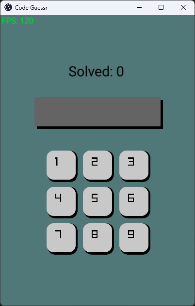

# Code Guesser

Simple raylib test project (basic UI). The main goal of this project was to create a standalone
exe with no external dependencies. The game is simple. Guess the correct code. The color of
the input field changes based on how many correct numbers there are (in the correct position).

## Installation (with MSYS2)
- Go through setup process to get mingw compiler working with VSCode
- Search for raylib package in mingw repository `pacman -Ss raylib`
- Copy package name that matches g++ version (default is ucrt64)
- Install package with `pacman -S {...}`
- (FYI: `-lraylib` flag was added to tasks.json manually)

## Release
- Run release.bat
- Note: needs to have raylib sources files downloaded to default location (C:/raylib/raylib/src)
- Can get raylib source code from https://www.raylib.com/